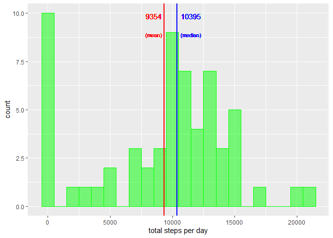
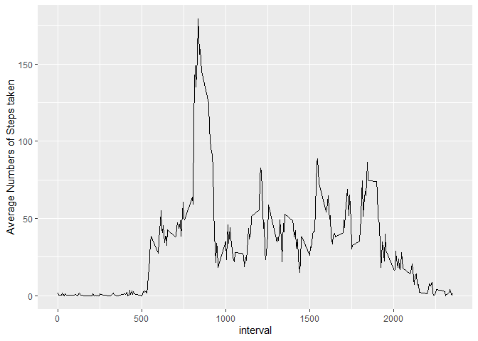
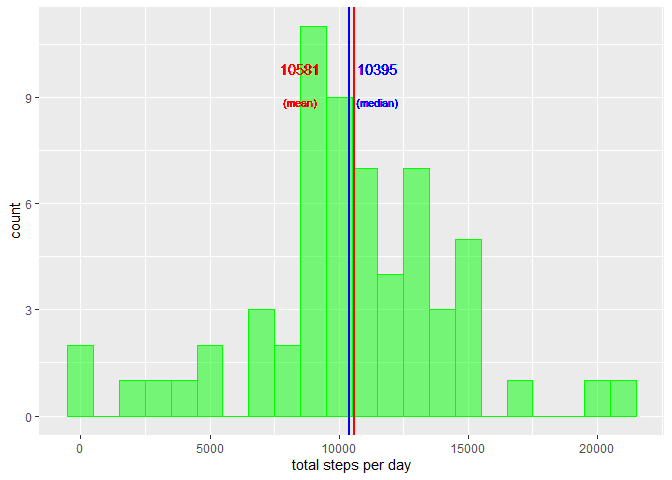
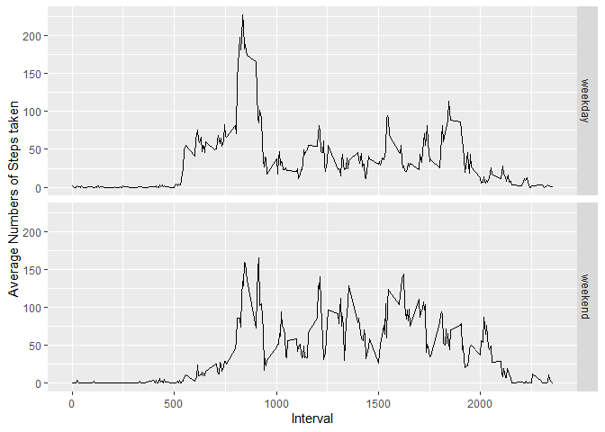

First load necessary packages.  

```r
setwd("~/coursera/5. Reproducible Research/Wk 2/HW")

library(dplyr)
library(tidyr)
library(knitr)
library(markdown)
library(rmarkdown)
library(ggplot2)
```
Load the data (read.csv) 

```r
activity <- read.csv("activity.csv")
```
Q1 What is the mean total number of steps taken per day?  
For this part, missing values in the dataset are ignored.  

Reshape the dataset to a dataframe which has means of the total steps per day. 
And call the object, "stepbydate.  
Also, make sure that data in date is formatted as date.


```r
stepsbydate <- activity %>%
        group_by(date) %>%
        summarise(ttl.steps = sum(steps,na.rm = TRUE)) %>%
        mutate(date = as.Date(date,"%Y-%m-%d"))
```

Find out the mean and median of steps taken by day, using summary function.  


```r
summary(stepsbydate)
```

      date              ttl.steps    
 Min.   :2012-10-01   Min.   :    0  
 1st Qu.:2012-10-16   1st Qu.: 6778  
 Median :2012-10-31   Median :10395  
 Mean   :2012-10-31   Mean   : 9354  
 3rd Qu.:2012-11-15   3rd Qu.:12811  
 Max.   :2012-11-30   Max.   :21194  

Make a histogram of the total number of steps taken by day. 

```r
h <- ggplot(data = stepsbydate,aes(x=ttl.steps)) +
        geom_histogram(binwidth = 1000,
                       col = "green",fill = "green", alpha = 0.5) +
  geom_vline(aes(xintercept = mean(ttl.steps)),col='red',size=1)+ #add a line to show mean
  geom_vline(aes(xintercept = median(ttl.steps)),col='blue',size=1)+ #add a line to show median
  geom_text(aes(label=round(mean(ttl.steps),0),y=10,x=8500),
            vjust=1,col='red',size=4) + #add the mean value
  geom_text(aes(label=round(median(ttl.steps),0),y=10,x=11500),
          vjust=1,col='blue',size=4) + #add the median value
  geom_text(aes(label="(mean)",y=9,x=8500),
            vjust=1,col='red',size=3) + # label the mean value
  geom_text(aes(label="(median)",y=9,x=11500),
            vjust=1,col='blue',size=3) +  #label the median value
  xlab("total steps per day")
  
h
```



Project1 - Q2  
What is the average daily activity pattern?  

Find the how many days in the "activity"data.


```r
length(unique(stepsbydate$date))
```

[1] 61

To make a time series plot of the 5-minute interval (x-axis) and the average number of steps taken,averaged across all days (y-axis), create a dataset called "activity2".


```r
activity2 <- activity %>%
  group_by(interval)%>%
  summarise(ttl.steps = sum(steps,na.rm = TRUE))%>% 
  mutate(avesteps = ttl.steps/61)
```

Plot "activity2".


```r
q2 <- ggplot(data = activity2,aes(x = interval, y = avesteps)) + 
  geom_line(size = 0.5,na.rm = TRUE) +
  ylab("Average Numbers of Steps taken")
              
q2
```



To find which 5-minute interval, on average across all the days in the dataset, contains the maximum number of steps,  
1. First, find the maximum value of average steps from the dataset  
2. Filter the dataset using the velue from #1


```r
maxave <-  max(activity2$avesteps, na.rm = TRUE)

maxinterval <- activity2 %>%
  filter(avesteps == max(avesteps, na.rm = TRUE)) %>%
  subset(select = interval)

maxinterval
```

# A tibble: 1 x 1
  interval
     <int>
1      835

So, the interval, 835 has the maximum number of steps, on average across all the days
in the dataset.

Now the missing data will be imputed by the mean number of steps for the interval. 

Count the number of "NA" in column "steps", "date", "interval".


```r
sum(is.na(activity$steps))
```

[1] 2304

```r
sum(is.na(activity$date))
```

[1] 0

```r
sum(is.na(activity$interval))
```

[1] 0

So we know that only "steps' column contains NA.  
There are **2304** missing values in the column.

First replace NA with "0" so that "aggregate' function can be used.  

```r
XnoNA <- activity %>%
  mutate(steps = ifelse(is.na(steps),0,steps))
```

Make a table showing mean # of steps by each interval and saved it in a data frame
called **"meanbyinterval"**.  We will replace any missing data in "steps" column with the mean number of steps for an equivalent interval.


```r
meanbyinterval <- aggregate(XnoNA[,1],list(XnoNA$interval),mean)
meanbyinterval <- meanbyinterval%>%
  rename(interval = Group.1, mean.steps = x)
```

Make a imputed list
 1.create a new column for interval mean for each interval (auto name = mean.steps)
 2.create a new column which shows each interval's mean steps
if steps  = NA (missing value), or else, leave as they are


```r
imputed <- activity %>%
  inner_join(meanbyinterval, by = "interval") %>%
  mutate(steps = ifelse(is.na(steps),mean.steps,steps))
```

To make a histogram of the total number of steps taken each day,
again create a data frame showing ttl steps by date.
We call this object as "stepbydate2".  


```r
stepsbydate2 <- imputed %>%
  group_by(date) %>%
  summarise(ttl.steps = sum(steps)) %>%
  mutate(date = as.Date(date,"%Y-%m-%d"))
```

Find out the mean and median total number of steps taken per day.

```r
summary(stepsbydate2)
```

      date              ttl.steps    
 Min.   :2012-10-01   Min.   :   41  
 1st Qu.:2012-10-16   1st Qu.: 9354  
 Median :2012-10-31   Median :10395  
 Mean   :2012-10-31   Mean   :10581  
 3rd Qu.:2012-11-15   3rd Qu.:12811  
 Max.   :2012-11-30   Max.   :21194  


Then make a histogram of ttl number of steps per day.


```r
h3 <- ggplot(data = stepsbydate2,aes(x=ttl.steps)) +
  geom_histogram(binwidth = 1000,
                 col = "green",fill = "green", alpha = 0.5) +
  geom_vline(aes(xintercept = mean(ttl.steps)),col='red',size=1)+ #add a line to show mean
  geom_vline(aes(xintercept = median(ttl.steps)),col='blue',size=1)+ #add a line to show median
  geom_text(aes(label=round(mean(ttl.steps),0),y=10,x=8500),
            vjust=1,col='red',size=4) + #add the mean value
  geom_text(aes(label=round(median(ttl.steps),0),y=10,x=11500),
            vjust=1,col='blue',size=4) + #add the median value
  geom_text(aes(label="(mean)",y=9,x=8500),
            vjust=1,col='red',size=3) + # label the mean value
  geom_text(aes(label="(median)",y=9,x=11500),
            vjust=1,col='blue',size=3) +  #label the median value
  xlab("total steps per day")

h3
```



This histogram is different from the one created eariler.


The mean is **1.0581 &times; 10<sup>4</sup>**.
The median is **1.0395 &times; 10<sup>4</sup>**.

So, by imputing missing values by mean number of steps for an equivalant
interval pulled the mean up, but the median was not changed.

The last question is **"Are there differences in activity patterns
between weekdays and weekend?"**

Using the previously created data frame, **"meanbyinterval"**, which shows the mean steps for each interval across all 61 days, make a imputed list.

1.create a new column for interval mean for each interval (auto name = mean.steps)
2.create a new column which shows each interval's mean steps if steps  = NA (missing value), or else, leave as they are.


```r
imputed_wk <- activity %>%
  inner_join(meanbyinterval, by = "interval") %>%
  mutate(steps = ifelse(is.na(steps),mean.steps,steps)) %>%
  mutate(date = as.Date(date,"%Y-%m-%d")) %>%
  mutate(weekdays = as.factor(weekdays(date))) %>%
  mutate(weekdays.cat = as.factor(ifelse(weekdays %in% c("Saturday", "Sunday"),"weekend","weekday")))
```


Find how many days are weekdays

```r
weekdays <- imputed_wk %>%
  filter(weekdays.cat == "weekday")
unique(weekdays$weekdays)
```

[1] Monday    Tuesday   Wednesday Thursday  Friday   
Levels: Friday Monday Saturday Sunday Thursday Tuesday Wednesday

```r
length(unique(weekdays$date))
```

[1] 45

45 days are weekdays.

Find how many days are weekend

```r
weekend <- imputed_wk %>%
  filter(weekdays.cat == "weekend")
unique(weekend$weekdays)
```

[1] Saturday Sunday  
Levels: Friday Monday Saturday Sunday Thursday Tuesday Wednesday

```r
length(unique(weekend$date))
```

[1] 16

16 days are weekend.

Create a data frame to include only weekend.


```r
weekend<- imputed_wk %>%
  filter(weekdays.cat == "weekend") %>%
  group_by(interval)%>%
  summarise(ttl.steps = sum(steps))%>% 
  mutate(avesteps = ttl.steps/16) %>%
  mutate(weekdays.cat = c("weekend"))
```

Create the one for weekdays and do the same.


```r
weekday<- imputed_wk %>%
  filter(weekdays.cat == "weekday") %>%
  group_by(interval)%>%
  summarise(ttl.steps = sum(steps))%>% 
  mutate(avesteps = ttl.steps/45) %>%
  mutate(weekdays.cat = c("weekday"))
```

Combine weekend and weekday dataframes and create an object, "all".


```r
all <- rbind(weekend, weekday)
```

Then create a panel plot containing a time series plot of the 5-minute interval(x-axis) and the average number of steps taken, across all weekday days or weekend days (y-axis).


```r
q4 <- ggplot(data = all,aes(x = interval, y = avesteps)) + 
  geom_line(size = 0.5,na.rm = TRUE) +
  facet_grid(weekdays.cat~.) +
  ylab("Average Numbers of Steps taken") +
  xlab("Interval")

q4
```




```r
setwd("~/coursera/5. Reproducible Research/Wk 2/HW")
library(knitr)
knit("PA1_template.Rmd",output = NULL)
```

```
## 
## 
## processing file: PA1_template.Rmd
```

```
## Error in parse_block(g[-1], g[1], params.src): duplicate label 'setup'
```
